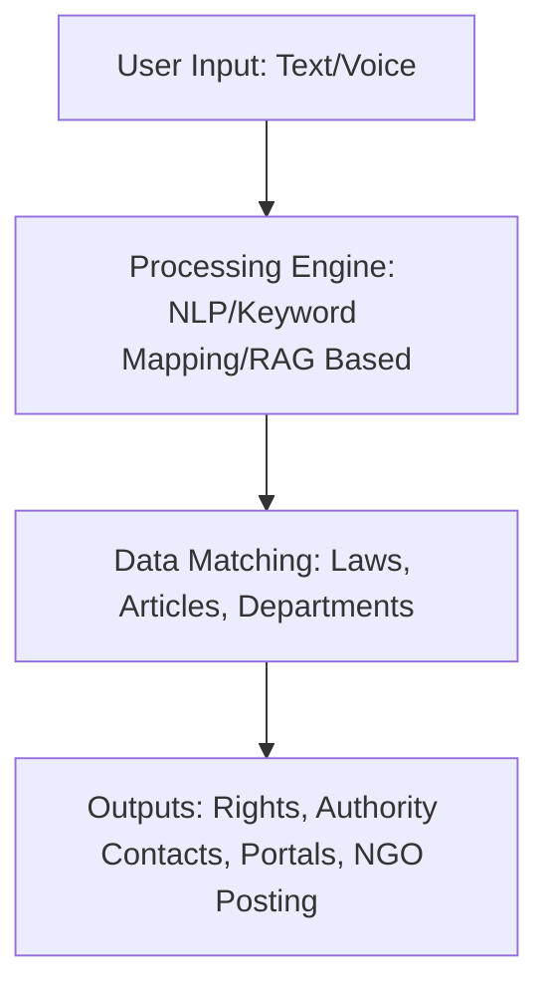

# 📜 Samvidhan.ai
*Your Guide to Constitutional Empowerment*

## 📖 Overview
**Samvidhan.ai** is a citizen-centric platform designed to **bridge the gap between people and the Constitution of India**.

Millions of citizens struggle with **inaccessible legal language**, **lack of awareness**, and **barriers to justice**. Our platform simplifies access to **fundamental rights** by mapping user-reported issues to relevant laws, acts, and complaint mechanisms — while also enabling support from NGOs and activists.

*"Justice is denied to many, not because they are not entitled to it, but because they are not aware of it."*

## 🚨 Problem Statement
- ⚖️ **Complex Legal Language** – Constitution filled with inaccessible terms
- ❌ **Lack of Awareness** – Citizens unaware of their rights
- 🚪 **Access Barriers** – Limited reach to legal remedies in rural/remote areas

## 💡 Solution Workflow
1. **Problem Input** → Citizens enter issue in simple text/voice
2. **Constitutional Mapping** → Platform identifies relevant rights, laws, and acts
3. **Redressal Guidance** → Details of complaint offices & portals
4. **NGO Support** → Option to post issues for NGOs/activists

**Example:** Child denied school admission → Highlights **Right to Education (Article 21A, RTE Act)** + DEO details + complaint portal link

## ⚙️ Tech Stack
- **Frontend:** React.js, HTML, CSS, JavaScript
- **Backend:** Node.js / PHP
- **Database:** MySQL
- **Future Layer:** Natural Language Processing (NLP)

## 🏗️ System Architecture



## 🔑 Key Modules
- 👤 **User Module** → Submit problems, view solutions, NGO posting
- 🛠️ **Admin Module** → Manage laws, rights, offices; verify issues
- 🏛️ **NGO Module (Future)** → Browse issues, support PILs

## 🚀 Roadmap / Future Enhancements
- 🤖 AI Chatbot for real-time query resolution
- 🌐 Regional language support for inclusivity
- 🔗 Integration with RTI, NALSA, and grievance portals
- 📱 Mobile application for on-the-go access
- 🤝 Partnerships with NGOs and legal aid centers

## ⚡ Installation & Setup

### 🔹 Prerequisites
- Node.js installed
- MySQL server installed
- Git installed

### 🔹 Clone the Repository
```bash
git clone https://github.com/<your-username>/Samvidhan.ai.git
cd Samvidhan.ai
```

### 🔹 Frontend Setup
```bash
cd frontend
npm install
npm start
```

### 🔹 Backend Setup
```bash
cd backend
npm install
npm run dev
```

### 🔹 Database Setup
1. Install MySQL and create a database (e.g., `samvidhan_db`)
2. Import schema file (if provided) into MySQL
3. Update DB credentials in backend config

## 📊 Impact Goals
- **100% Constitutional Awareness** – Empower citizens with legal knowledge
- **Unified Solution** – Connect problems → rights → solutions
- **70% Gap Reduction** – Bridge divide between citizens & Constitution

## 👨‍👩‍👦 Team
- **PramodPillitla**
- **Sameed**
- **Chandu**
- **KiranYela**


Rajiv Gandhi University of Knowledge Technologies, Basar

## 🤝 Contributing
We welcome contributions! 🚀

1. Fork the repo
2. Create a feature branch
   ```bash
   git checkout -b feature/AmazingFeature
   ```
3. Commit your changes
   ```bash
   git commit -m 'Add AmazingFeature'
   ```
4. Push to your branch
   ```bash
   git push origin feature/AmazingFeature
   ```
5. Open a Pull Request

## 📜 License
This project is licensed under the **MIT License** – see the LICENSE file for details.

---

✨ *Samvidhan.ai: Empowering Every Citizen with Constitutional Awareness* ✨

## 🌟 Star this repository if you found it helpful!

[](https://github.com/kiranyela/Samvidhan.ai)
[](https://github.com/kiranyela/Samvidhan.ai/fork)

---

*Made with ❤️ for the citizens of India*
