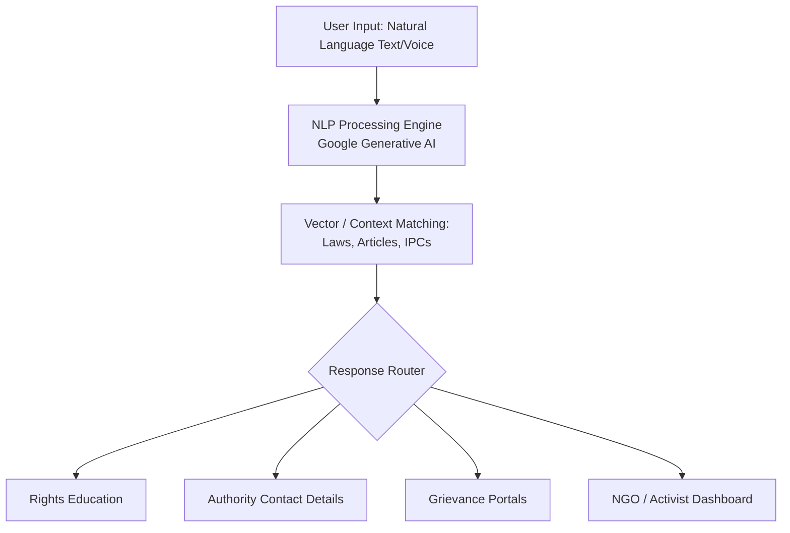

<div align="center">
  <h1>📜 Samvidhan.ai</h1>
  <p><em>Your Guide to Constitutional Empowerment and Access to Justice</em></p>
  
  [](https://github.com/kiranyela/Samvidhan.ai)
  [](https://github.com/kiranyela/Samvidhan.ai/fork)
  [](https://opensource.org/licenses/MIT)
</div>

<hr>

## 📖 Overview

**Samvidhan.ai** is a comprehensive, citizen-centric platform engineered to bridge the critical gap between the general public and the Constitution of India. 

Millions of citizens face barriers to justice due to complex legal vernacular, limited constitutional awareness, and systemic friction in reporting grievances. Our platform democratizes access to fundamental rights by leveraging AI to map user-reported issues (such as environmental violations, educational denials, etc.) directly to the pertinent laws, acts, and appropriate complaint mechanisms. It also facilitates a streamlined pipeline for NGOs and activists to intervene and escalate issues effectively.

> *"Justice is denied to many, not because they are not entitled to it, but because they are not aware of it."*

---

## 🚨 The Problem

1. ⚖️ **Complex Legal Lexicon:** The Indian Constitution and subsequent penal codes are drafted in language that is often inaccessible to the layperson.
2. ❌ **Knowledge Asymmetry:** Citizens are frequently unaware of their fundamental rights and the corresponding legal recourse available to them.
3. 🚪 **Access Barriers:** Marginalized communities and rural populations face significant friction when navigating the bureaucratic maze to file grievances.

---

## 💡 Our Solution Architecture

Samvidhan.ai abstracts the complexity of the legal system through an intuitive, multi-stage workflow:

1. **Problem Ingestion:** Citizens input their grievances in natural language (text or voice).
2. **Constitutional Mapping:** Leveraging advanced NLP (via Google Generative AI), the platform contextually maps the grievance to relevant constitutional articles, statutory laws, and acts.
3. **Redressal Routing:** Automatically surfaces the correct departmental contacts, grievance portals, and procedural steps for filing a complaint.
4. **NGO Escalation:** Provides an ecosystem for NGOs and legal activists to discover and adopt unaddressed public interest issues (PILs).

**Example Scenario:** A community reporting severe water pollution. The platform processes the input, highlights **Article 21 (Protection of Life and Personal Liberty - Right to a Clean Environment)**, and directs the user to the National Green Tribunal (NGT) and local pollution control boards.

---

## 📸 Platform Previews & Sample Use Cases

Here are some sample scenarios our platform is designed to handle, such as reporting environmental and public infrastructure violations:

<div align="center">
  
  
</div>

<div align="center">
  
  
  
</div>

> *Note: The above images represent the types of public grievances (e.g., severe water contamination, public negligence) that citizens can seamlessly report through Samvidhan.ai for constitutional mapping and legal routing.*

---

## ⚙️ Technology Stack

The platform is built on a robust, modern MERN stack, ensuring scalability, performance, and a seamless developer experience.

### Frontend
- **React 19 & Vite:** Ultra-fast, component-driven UI architecture.
- **Tailwind CSS 4:** Utility-first styling for a highly responsive, modern aesthetic.
- **Framer Motion:** Fluid micro-interactions and animations.
- **Headless UI & Lucide React:** Accessible components and crisp iconography.

### Backend & AI
- **Node.js & Express 5:** High-throughput, asynchronous API serving.
- **Google Generative AI:** Powers the core NLP engine for legal document mapping.
- **Authentication & Security:** JWT, Passport (Google OAuth2.0), bcrypt.
- **File Handling:** Multer and Cloudinary for robust asset management.

### Database
- **MongoDB & Mongoose:** Flexible, schema-driven NoSQL document storage.

---

## 🏗️ System Architecture


```mermaid
flowchart TD
    A[User Input: Natural Language Text/Voice] --> B[NLP Processing Engine <br/> Google Generative AI]
    B --> C[Vector / Context Matching: <br/> Laws, Articles, IPCs]
    C --> D{Response Router}
    D --> E[Rights Education]
    D --> F[Authority Contact Details]
    D --> G[Grievance Portals]
    D --> H[NGO / Activist Dashboard]
```

---

## 🔑 Key Modules

- 👤 **Citizen Portal:** Submit grievances via multi-modal inputs, receive step-by-step legal recourse, and track issue status.
- 🛠️ **Admin Dashboard:** Manage the legal repository, verify incoming grievances, and oversee platform health.
- 🏛️ **NGO/Activist Portal (Future):** Dedicated feed for public interest issues, enabling swift legal intervention and PIL drafting.

---

## 🚀 Roadmap & Future Enhancements

- [ ] **AI Conversational Agent:** Real-time, multilingual legal counsel.
- [ ] **Vernacular Support:** Deep localization for diverse Indian languages.
- [ ] **API Integrations:** Direct hooks into RTI, NALSA, and state grievance portals.
- [ ] **Mobile Ecosystem:** Native iOS and Android applications.
- [ ] **Institutional Partnerships:** Integration with law schools and legal aid clinics.

---

## ⚡ Installation & Local Development Setup

### 🔹 Prerequisites
- **Node.js** (v18 or higher recommended)
- **MongoDB** (Local instance or Atlas URI)
- **Git**

### 🔹 1. Clone the Repository
```bash
git clone https://github.com/kiranyela/Samvidhan.ai.git
cd Samvidhan.ai
```

### 🔹 2. Backend Setup
```bash
cd Backend
npm install

# Create a .env file based on .env.sample and configure your DB/AI keys
cp .env.sample .env

# Start the development server
npm run dev
```

### 🔹 3. Frontend Setup
Open a new terminal window:
```bash
cd frontend
npm install

# Start the Vite development server
npm run dev
```

---

## 📊 Impact & Vision

Our goal is to achieve **100% Constitutional Awareness** by transforming abstract legal rights into actionable, everyday tools for the common citizen. By bridging the knowledge gap, we aim to reduce the friction between systemic issues and their constitutional remedies by over **70%**.

---

## 👨‍💻 Core Team

- **Pramodh** 
- **Sameed** 
- **Chandu** 
- **KiranYela**

*Rajiv Gandhi University of Knowledge Technologies, Basar*

---

## 🤝 Contributing

We actively welcome contributions from the open-source community! 🚀

1. **Fork** the repository
2. **Create** a feature branch (`git checkout -b feature/NextGenFeature`)
3. **Commit** your changes (`git commit -m 'feat: Add NextGenFeature'`)
4. **Push** to the branch (`git push origin feature/NextGenFeature`)
5. **Open** a Pull Request

---

## 📜 License

This project is licensed under the **MIT License**. See the `LICENSE` file for full details.

<div align="center">
  <p>✨ <em>Samvidhan.ai: Empowering Every Citizen with Constitutional Awareness</em> ✨</p>
  <p>Made with ❤️ for the citizens of India</p>
</div>
